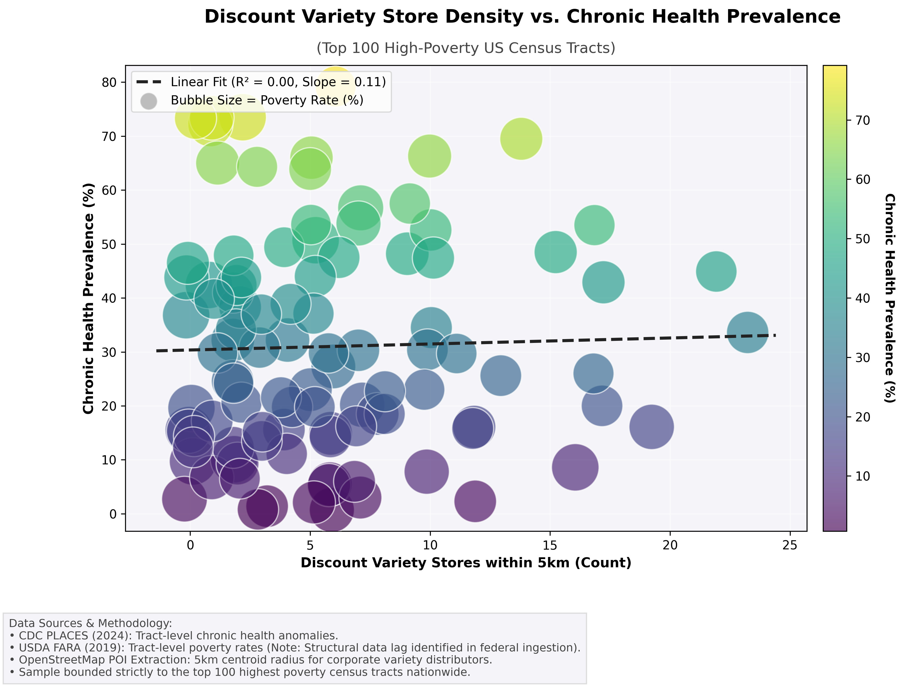
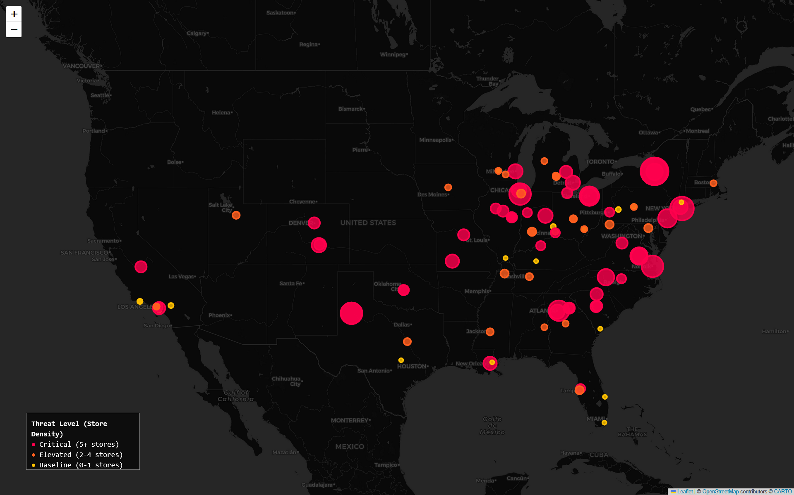
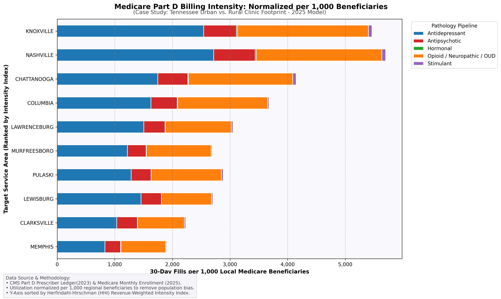
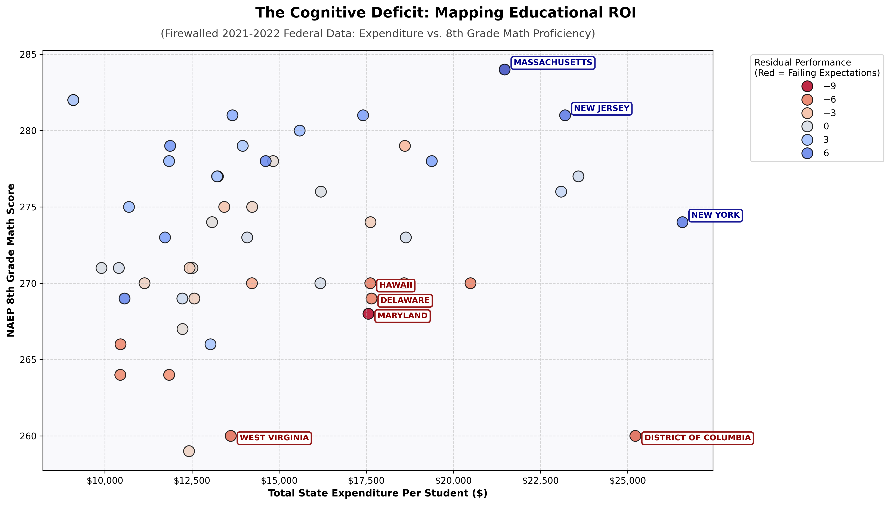

# Project Rigor Mortis: A Symposium of Systemic Toxicity

**"From the Grain to the Glitch"**

## 1. Abstract

**"Exploration and Illumination"**

This repository serves as a **compendium** of structural parallels between the "Generally Recognized as Safe" (GRAS) loophole in the US food supply and the "Terms of Service" (ToS) consent loopholes in Big Tech. It documents the "Slow Kill" paradigm—where latency is used to obfuscate liability.

> **Status Note:** This project has transitioned from structural prototyping to active data ingestion. The Analysis Engine (`src/correlation_mapper.py`, `src/cms_prescriber_audit.py`, `src/education_roi_audit.py`) currently processes raw federal datasets (CDC PLACES, USDA FARA, NAEP, CMS Part D) alongside live OSINT spatial telemetry to mathematically map the correlation between consumption, environment, and pathology. This is a living civic audit; data will be continuously refined to combat federal reporting latency and structural siloing.

## 2. The Modules (Research Vectors)

### [Phase I: The Biological Backdoor](./docs/01_biological_backdoor.md)

- **Focus:** The "Cereal Killer" Logic (BHT, Chlormequat).
- **The Loophole:** GRAS self-regulation vs. Public Health.

### [Phase II: The Psychological Backdoor](./docs/02_psychological_backdoor.md)

- **Focus:** The API as a Surveillance Tool.
- **The Mechanism:** 3rd Party Data Brokerage & Algorithmic Addiction.

### [Phase III: The Sterility Vector](./docs/03_sterility_vector.md)

- **Focus:** The "Silent Castration" (Porcine/Human Analogs).
- **The Data:** Danish Pig Studies vs. Global Fertility Rates.

### [Phase IV: Mortality & Identity](./docs/04_mortality_metrics.md)

- **Focus:** The Cost of "Programming" & Identity Fracture.
- **The Metric:** Trevor Project 2024 Data vs. High-Engagement Algorithms.

### [Phase V: The Pharma Integration](./docs/05_the_pharma_complex.md)

- **Focus:** The "Invisibility Shield" & Symptom Monetization.
- **The Mechanism:** 340B Loopholes, IRS Form 990 Charity Deficits, and the Psychiatric Pipeline.

### [Phase VI: The Cognitive Deficit](./docs/06_the_cognitive_deficit.md)

- **Focus:** The "Inverse ROI" & Cognitive Baseline Degradation.
- **The Mechanism:** Bypassing manipulated state graduation rates using federal NAEP standardizations vs. NCES Expenditure mapping.

## 3. The Tooling

### [Correlation Mapper](./src/correlation_mapper.py)

- **Objective:** Mapping "Dollar General" density vs. CDC Cancer/Morbidity Rates.
- **Status:** _Static POI Density Mapping Active._

### [CMS Prescriber Audit](./src/cms_prescriber_audit.py)

- **Objective:** Mapping the "Fair Share" Deficit and 340B/Medicare Arbitrage via the Herfindahl-Hirschman Index (HHI).
- **Status:** _CMS Part D Normalized Intensity Model Active._

### [Education ROI Audit](./src/education_roi_audit.py)

- **Objective:** Mapping the "Cost Per Math Point" to identify states leveraging academic failure to justify administrative financial bloat, while mathematically controlling for local poverty and demographics.
- **Status:** _NCES/NAEP Integration & Inverse ROI OLS Model Active._

> **The Data Latency Firewall:** The federal datasets used in this engine highlight a severe structural obfuscation. The CDC health data is current to 2024, the USDA Food Access Research Atlas (FARA) is constrained to 2019, the CMS Part D Ledger is firewalled at 2023, and the NAEP/NCES education metrics are firewalled at 2021-2022. **When operations are 100% taxpayer-subsidized, visibility is not optional.** This built-in 2-to-3-year reporting latency makes real-time, cross-agency health and financial auditing intentionally difficult. The analysis engines bypass this by normalizing the timeline delta via FIPS tract matching, OLS regression, and per-capita utilization models.

## 4. The "Slow Kill" Matrix (Visual Receipts)

#### A. Statistical Correlation Chart

**How to Read This Data:**
This matrix visualizes the **Top 100 most impoverished Census Tracts** in the United States, cross-referencing federal `CDC/USDA` data with `OpenStreetMap` distributor density.

- **The Conclusion:** There is a positive association between ultra-processed discount store density and chronic health prevalence among high-poverty tracts.

#### B. Geospatial Threat Map (Folium)

- **Crimson (5+ Stores):** Critical Density. The tract is saturated by ultra-processed inventory.

#### C. The "**Compounding Asset**" Matrix (_CMS Ledger_)

**How to Read This Data:**
This matrix visualizes the financial exhaust of the Pharma Complex (**Phase V**), utilizing the federal **CMS Part D Prescriber Ledger**.

- **The Conclusion:** The financial data proves the pharmacological load is heavily targeted at rural poverty anchors (e.g., Columbia vs. Clarksville TN). DOJ-level HHI concentration (>0.25) in target areas indicates these facilities operate as highly concentrated distribution hubs for chronic symptom management.

#### D. The "**Cognitive Deficit**" Matrix (_Educational ROI_)

**How to Read This Data:**
This matrix maps the structural efficiency of the educational pipeline (**Phase VI**), bypassing compromised state-level graduation rates in favor of the unvarnished federal NAEP scores. It utilizes an OLS regression model to completely remove "socioeconomic demographic" excuses.

- **The Conclusion:** The matrix explicitly identifies the geographic "Capital Sinkholes." The data proves that the heavily funded "War on Public Schools" is actually a structural success. For example, **Washington D.C.**, **Delaware** (the corporate/Silicon Valley haven), and **Maryland** spend top-tier capital (over $20K-$25K per student) to yield bottom-tier cognitive residuals. Conversely, Southern and Appalachian regions (e.g., Mississippi, Alabama, West Virginia) display systemic baseline decay despite federal intervention. Furthermore, the statistical receipt proves that raw financial expenditure is statistically irrelevant (`p=0.475`) to academic success. By financially rewarding administrative bloat and failing testing metrics, the system guarantees a compliant, un-educated demographic ripe for Phase II algorithmic manipulation and Phase V psychiatric management.

## 5. The Evidence Locker (Receipts)

A chain-of-custody archive for primary source documentation.

### [Reports & Audits](./receipts/reports/)

- **Kim (2023):** Duke University Policy Lab report on the sale of mental health data.
- **Facebook Files (2021):** Internal "Teen Mental Health Deep Dive" deck.
- **Trevor Project (2024):** Suicidality and Identity metrics.
- **[Phase V: CMS Concentration Index](./receipts/reports/v8_3_city_concentration.csv):** Rigor Mortis V8.3 output calculating the HHI for targeted clinics, proving monopolistic revenue reliance on specific psychiatric/opioid pipelines.
- **[Phase VI: State ROI Rankings Ledger](./receipts/reports/vi_1_state_roi_rankings.csv):** The indexed public-facing hit list tracking each state's expenditure against its residual mathematical failure.
- **[Phase VI: Education Regression Summary](./receipts/reports/phase_6_regression_summary.txt):** The hard mathematical OLS baseline proving the inverse ROI of state-level education spending against 8th Grade Math scores, strictly neutralizing Census ACS poverty and language demographic excuses.

### [Toxicology](./receipts/toxicology/)

- **Levine et al. (2017):** Meta-analysis of Western sperm count decline (52.4% drop).
- **The Paraquat Papers:** Internal Syngenta memos regarding emetic additives and toxicity.

### OSINT & External Datasets

> **Note on Raw Data:** Due to GitHub's file size constraints, the raw `.csv` files used for local mapping are excluded via `.gitignore`. For full transparency and civic auditing, you can pull the exact primary source datasets below.

- **[US Discount Food Store Footprint (2026)](https://www.kaggle.com/datasets/colbycsalim/us-discount-variety-store-footprint-2026):** Consolidated OpenStreetMap extraction for Dollar General/Family Dollar coordinates.
- **[CDC PLACES: Local Data for Better Health](https://data.cdc.gov/500-Cities-Places/PLACES-Local-Data-for-Better-Health-Census-Tract-D/cwsq-ngmh/about_data):** Census tract-level health metrics.
- **[USDA Food Access Research Atlas](https://www.ers.usda.gov/data-products/food-access-research-atlas/download-the-data):** Food desert and geographic accessibility metrics.
- **[FDA GRAS Substances (SCOGS) Database](https://www.fda.gov/food/generally-recognized-safe-gras/gras-substances-scogs-database):** Generally Recognized as Safe list for additive cross-referencing.
- **[CMS Part D Prescribers](https://data.cms.gov/provider-summary-by-type-of-service/medicare-part-d-prescribers/medicare-part-d-prescribers-by-provider-and-drug):** Federal ledger of subsidized prescription billing.
- **[NAEP Data Explorer](https://www.nationsreportcard.gov/ndecore/xplore/NDE):** National Assessment of Educational Progress (2022 Mathematics Assessment, Grade 8).
- **[NCES Common Core of Data](https://nces.ed.gov/ccd/):** National Public Education Financial Survey (Fiscal Year 2021).
